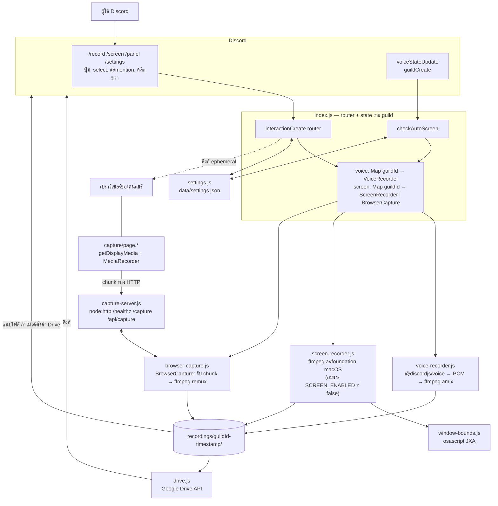

# 1. ภาพรวมระบบ

```mermaid
flowchart TB
    U["ผู้ใช้ Discord"]
    subgraph DC["Discord"]
        CMD["/record /screen /panel /settings<br/>ปุ่ม, select, @mention, คลิกขวา"]
        EV["voiceStateUpdate<br/>guildCreate"]
    end
    subgraph BOT["index.js — router + state ราย guild"]
        R["interactionCreate router"]
        ST["voice: Map guildId → VoiceRecorder<br/>screen: Map guildId → ScreenRecorder | BrowserCapture"]
        AUTO["checkAutoScreen"]
    end
    SET["settings.js<br/>data/settings.json"]
    VR["voice-recorder.js<br/>@discordjs/voice → PCM → ffmpeg amix"]
    SR["screen-recorder.js<br/>ffmpeg avfoundation macOS<br/>(เฉพาะ SCREEN_ENABLED ≠ false)"]
    WB["window-bounds.js<br/>osascript JXA"]
    BC["browser-capture.js<br/>BrowserCapture: รับ chunk → ffmpeg remux"]
    CS["capture-server.js<br/>node:http /healthz /capture /api/capture"]
    PG["capture/page.*<br/>getDisplayMedia + MediaRecorder"]
    SH["เบราว์เซอร์ของคนแชร์"]
    FS[("recordings/guildId-timestamp/")]
    DRV["drive.js<br/>Google Drive API"]

    U --> CMD --> R
    EV --> AUTO
    R --> ST
    AUTO --> ST
    R <--> SET
    AUTO <--> SET
    ST --> VR
    ST --> SR
    ST --> BC
    CS <--> BC
    SH --- PG
    PG -->|"chunk ทาง HTTP"| CS
    R -.->|"ลิงก์ ephemeral"| SH
    SR --> WB
    VR --> FS
    SR --> FS
    BC --> FS
    FS --> DRV
    DRV -->|"ลิงก์"| DC
    FS -->|"แนบไฟล์ ถ้าไม่ได้ตั้งค่า Drive"| DC
```
