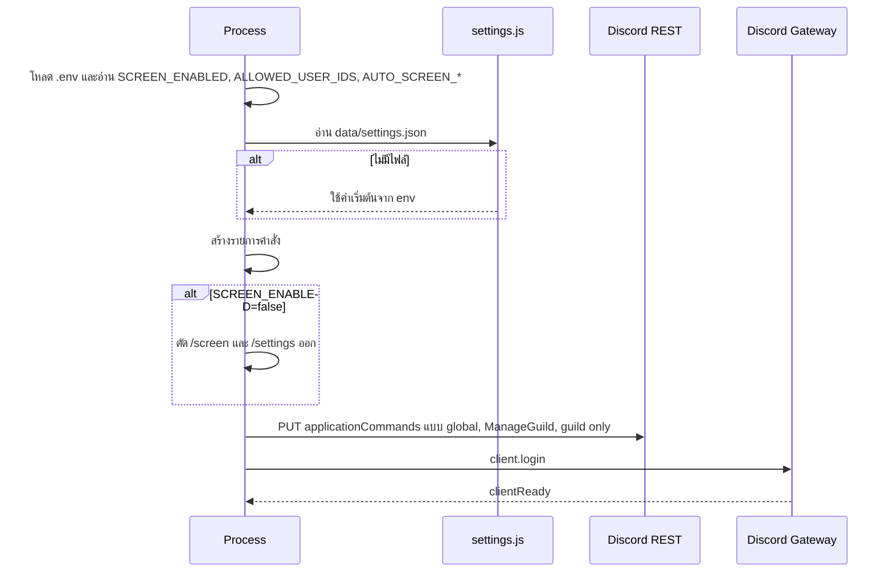

# 2. ตอนบอทเริ่มทำงาน

```mermaid
sequenceDiagram
    participant P as Process
    participant S as settings.js
    participant REST as Discord REST
    participant GW as Discord Gateway
    P->>P: โหลด .env และอ่าน SCREEN_ENABLED, ALLOWED_USER_IDS, AUTO_SCREEN_*
    P->>S: อ่าน data/settings.json
    alt ไม่มีไฟล์
        S-->>P: ใช้ค่าเริ่มต้นจาก env
    end
    P->>P: สร้างรายการคำสั่ง
    alt SCREEN_ENABLED=false
        P->>P: ตัด /screen และ /settings ออก
    end
    P->>REST: PUT applicationCommands แบบ global, ManageGuild, guild only
    P->>GW: client.login
    GW-->>P: clientReady
```
