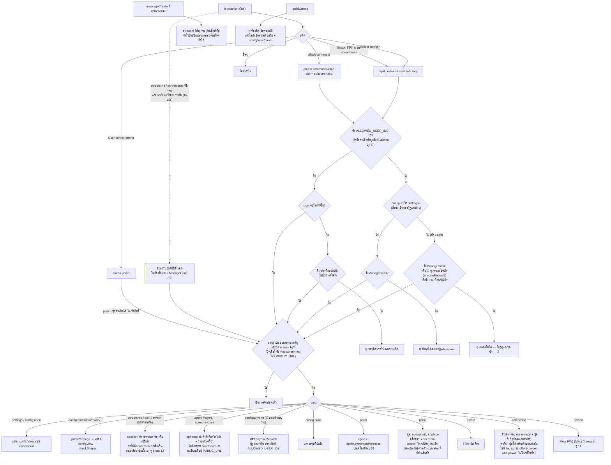

# 3. Routing คำสั่งและการตรวจสิทธิ์

```mermaid
flowchart TD
    IN["Interaction เข้ามา"] --> T{"ชนิด"}
    T -->|"Slash command"| A["cmd = commandName<br/>sub = subcommand"]
    T -->|"User context menu"| B["cmd = panel"]
    T -->|"Button ที่รู้จัก (รวม screen:me)"| C["split customId cmd:sub[:tag]"]
    T -->|"Select config:*"| C
    T -->|"อื่นๆ"| X["ไม่ทำอะไร"]
    A --> P1
    C --> P1
    B -->|"panel: ทุกคนเปิดได้ ไม่เช็กสิทธิ์"| SC
    IN -.->|"screen:me / screen:stop ที่มี tag<br/>และ user = เจ้าของการอัด (คนแชร์)"| OWN["ข้ามการเช็กสิทธิ์ทั้งหมด<br/>ไม่ต้องมี role / ManageGuild / 👥"]
    OWN --> SC

    P1{"ตั้ง ALLOWED_USER_IDS ไว้?<br/>(ถ้าตั้ง รายชื่อทับทุกสิทธิ์ และซ่อนปุ่ม 👥)"}
    P1 -->|"ใช่"| P2{"user อยู่ในรายชื่อ?"}
    P1 -->|"ไม่"| P3{"config:* หรือ settings?<br/>(ตั้งค่า เป็นของผู้ดูแลเสมอ)"}
    P2 -->|"ใช่"| SC
    P2 -->|"ไม่"| P2R{"มี role ที่กดอัดได้?<br/>(ไม่ใช่การตั้งค่า)"}
    P2R -->|"ใช่"| SC
    P2R -->|"ไม่"| DENY["🔒 บอทนี้จำกัดให้เฉพาะรายชื่อ"]
    P3 -->|"ใช่"| P4{"มี ManageGuild?"}
    P4 -->|"ใช่"| SC
    P4 -->|"ไม่"| DENY2["🔒 ตั้งค่าได้เฉพาะผู้ดูแล server"]
    P3 -->|"ไม่ (อัด / หยุด)"| P5{"มี ManageGuild<br/>หรือ 👥 ทุกคนกดอัดได้ (anyoneRecords)<br/>หรือมี role ที่กดอัดได้?"}
    P5 -->|"ใช่"| SC
    P5 -->|"ไม่"| DENY3["🔒 กดอัดไม่ได้ — ให้ผู้ดูแลเปิด ⚙️ → 👥"]

    SC{"cmd เป็น screen/config<br/>และปิด screen อยู่?<br/>(ปิดเมื่อไม่มี Mac screen และไม่มี PUBLIC_URL)"}
    SC -->|"ใช่"| OFF["ปิดการอัดหน้าจอไว้"]
    SC -->|"ไม่"| D{"cmd"}
    D -->|"settings / config:open"| CFG["แสดง configView แบบ ephemeral"]
    D -->|"config:cards/min/mode/..."| UPD["updateSettings → แสดง configView<br/>→ checkShares"]
    D -->|"screen:rec / cont / switch (กดจากการ์ด)"| SES["session: อัดจอคนแชร์ ต่อ หรือเปลี่ยน<br/>กดได้ถ้า canRecord หรือเป็นคนแชร์ของปุ่มนั้นเอง ดู 6 และ 12"]
    D -->|"agent (/agent, agent:revoke)"| AGT["ephemeral: คำสั่งติดตั้งตัวอัด + รายการเครื่อง<br/>ไม่ต้องผ่าน canRecord ลงทะเบียนเมื่อมี PUBLIC_URL"]
    D -->|"config:anyone (👥 บนหน้าแบบง่าย)"| ANY["สลับ anyoneRecords<br/>ผู้ดูแลเท่านั้น ซ่อนเมื่อมี ALLOWED_USER_IDS"]
    D -->|"config:done"| DONE["แสดงสรุปที่บันทึก"]
    D -->|"perm"| PERM["open x-apple.systempreferences<br/>บนเครื่องที่รันบอท"]
    D -->|"panel"| PNL["ปุ่ม: update แบบ in place<br/>คลิกขวา: ephemeral<br/>/panel: โพสต์ให้ทุกคนเห็น<br/>ซ่อนข้อเสนอส่วนตัว (private) ที่ยังไม่เริ่มอัด"]
    D -->|"record"| REC["Flow อัดเสียง"]
    D -->|"screen:me"| ME["เจ้าของ: ตอบ ephemeral + ปุ่มลิงก์ (ข้อเสนอส่วนตัว)<br/>คนอื่น: ปุ่มนี้สำหรับเจ้าของเท่านั้น<br/>ไม่มี tag (แผง): offerBrowser แบบ private ไม่โพสต์ในห้อง"]
    D -->|"screen"| SCR["Flow อัดจอ (Mac) / browser: ดู 11"]

    M["messageCreate ที่ @Recorder"] --> MP["ส่ง panel ให้ทุกคน (ไม่เช็กสิทธิ์)<br/>จำไว้ให้อัปเดตเองเฉพาะคนที่กดอัดได้"]
    G["guildCreate"] --> HELLO["หาห้องที่ส่งข้อความได้<br/>แล้วโพสต์ข้อความต้อนรับ + configView/panel"]
```
