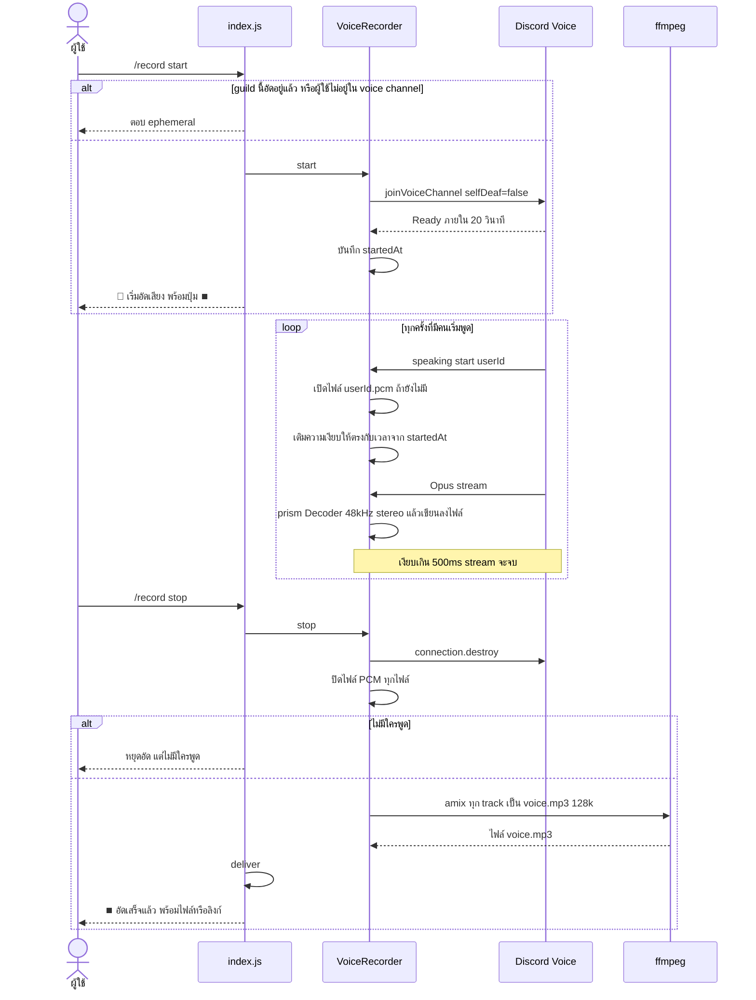

# 4. Flow อัดเสียง

```mermaid
sequenceDiagram
    actor U as ผู้ใช้
    participant B as index.js
    participant V as VoiceRecorder
    participant DV as Discord Voice
    participant FF as ffmpeg
    U->>B: /record start
    alt guild นี้อัดอยู่แล้ว หรือผู้ใช้ไม่อยู่ใน voice channel
        B-->>U: ตอบ ephemeral
    else
        B->>V: start
        V->>DV: joinVoiceChannel selfDeaf=false
        DV-->>V: Ready ภายใน 20 วินาที
        V->>V: บันทึก startedAt
        B-->>U: 🔴 เริ่มอัดเสียง พร้อมปุ่ม ⏹️
    end
    loop ทุกครั้งที่มีคนเริ่มพูด
        DV->>V: speaking start userId
        V->>V: เปิดไฟล์ userId.pcm ถ้ายังไม่มี
        V->>V: เติมความเงียบให้ตรงกับเวลาจาก startedAt
        DV->>V: Opus stream
        V->>V: prism Decoder 48kHz stereo แล้วเขียนลงไฟล์
        Note over V,DV: เงียบเกิน 500ms stream จะจบ
    end
    U->>B: /record stop
    B->>V: stop
    V->>DV: connection.destroy
    V->>V: ปิดไฟล์ PCM ทุกไฟล์
    alt ไม่มีใครพูด
        B-->>U: หยุดอัด แต่ไม่มีใครพูด
    else
        V->>FF: amix ทุก track เป็น voice.mp3 128k
        FF-->>V: ไฟล์ voice.mp3
        B->>B: deliver
        B-->>U: ⏹️ อัดเสร็จแล้ว พร้อมไฟล์หรือลิงก์
    end
```
