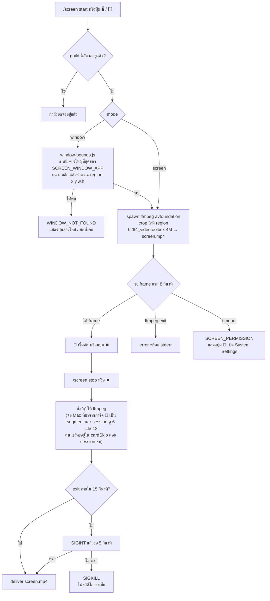

# 5. Flow อัดหน้าจอด้วยตัวเอง (macOS เท่านั้น)

```mermaid
flowchart TD
    S["/screen start หรือปุ่ม 🖥️ / 🪟"] --> A{"guild นี้อัดจออยู่แล้ว?"}
    A -->|"ใช่"| A1["กำลังอัดจออยู่แล้ว"]
    A -->|"ไม่"| M{"mode"}
    M -->|"window"| W["window-bounds.js<br/>หาหน้าต่างใหญ่ที่สุดของ SCREEN_WINDOW_APP<br/>บนจอหลัก แล้วคำนวณ region x,y,w,h"]
    W -->|"ไม่พบ"| WE["WINDOW_NOT_FOUND<br/>แสดงปุ่มลองใหม่ / อัดทั้งจอ"]
    W -->|"พบ"| F
    M -->|"screen"| F["spawn ffmpeg avfoundation<br/>crop ถ้ามี region<br/>h264_videotoolbox 4M → screen.mp4"]
    F --> R{"รอ frame แรก 8 วินาที"}
    R -->|"ได้ frame"| OK["🔴 เริ่มอัด พร้อมปุ่ม ⏹️"]
    R -->|"ffmpeg exit"| E1["error พร้อม stderr"]
    R -->|"timeout"| E2["SCREEN_PERMISSION<br/>แสดงปุ่ม 🔐 เปิด System Settings"]

    OK --> STOP["/screen stop หรือ ⏹️"]
    STOP --> Q["ส่ง 'q' ให้ ffmpeg<br/>(จอ Mac ที่มาจากการ์ด 🔴 เป็น segment ของ session ดู 6 และ 12<br/>คนแชร์จะอยู่ใน cardSkip ตอน session จบ)"]
    Q --> Q1{"exit ภายใน 15 วินาที?"}
    Q1 -->|"ใช่"| DL["deliver screen.mp4"]
    Q1 -->|"ไม่"| Q2["SIGINT แล้วรอ 5 วินาที"]
    Q2 -->|"exit"| DL
    Q2 -->|"ไม่ exit"| Q3["SIGKILL<br/>ไฟล์วิดีโออาจเสีย"]
```
