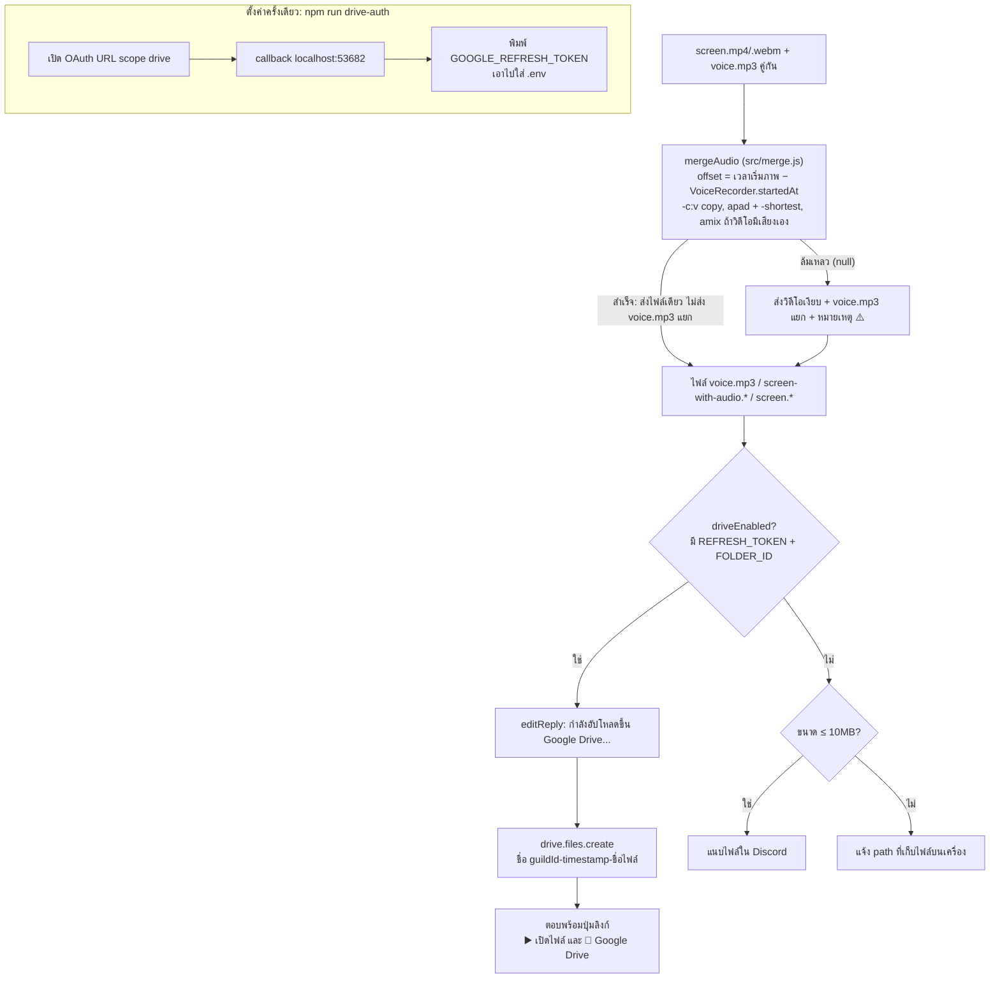

# 8. การส่งไฟล์ (deliver)

```mermaid
flowchart TD
    V["screen.mp4/.webm + voice.mp3 คู่กัน"] --> M["mergeAudio (src/merge.js)<br/>offset = เวลาเริ่มภาพ − VoiceRecorder.startedAt<br/>-c:v copy, apad + -shortest, amix ถ้าวิดีโอมีเสียงเอง"]
    M -->|"สำเร็จ: ส่งไฟล์เดียว ไม่ส่ง voice.mp3 แยก"| F
    M -->|"ล้มเหลว (null)"| F2["ส่งวิดีโอเงียบ + voice.mp3 แยก + หมายเหตุ ⚠️"] --> F
    F["ไฟล์ voice.mp3 / screen-with-audio.* / screen.*"] --> D{"driveEnabled?<br/>มี REFRESH_TOKEN + FOLDER_ID"}
    D -->|"ใช่"| U1["editReply: กำลังอัปโหลดขึ้น Google Drive..."]
    U1 --> U2["drive.files.create<br/>ชื่อ guildId-timestamp-ชื่อไฟล์"]
    U2 --> U3["ตอบพร้อมปุ่มลิงก์<br/>▶️ เปิดไฟล์ และ 📁 Google Drive"]
    D -->|"ไม่"| SZ{"ขนาด ≤ 10MB?"}
    SZ -->|"ใช่"| AT["แนบไฟล์ใน Discord"]
    SZ -->|"ไม่"| PATH["แจ้ง path ที่เก็บไฟล์บนเครื่อง"]

    subgraph ONE["ตั้งค่าครั้งเดียว: npm run drive-auth"]
        O1["เปิด OAuth URL scope drive"] --> O2["callback localhost:53682"] --> O3["พิมพ์ GOOGLE_REFRESH_TOKEN<br/>เอาไปใส่ .env"]
    end
```
