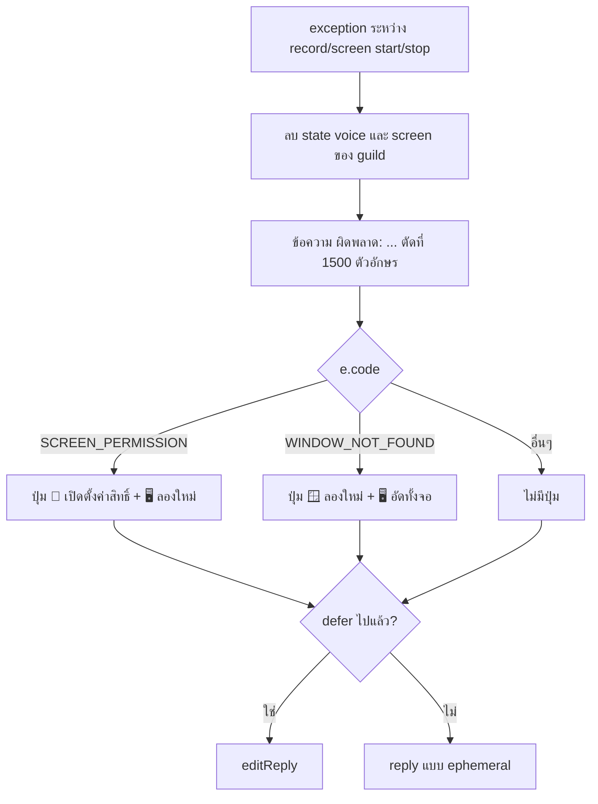

# 9. Error handling

```mermaid
flowchart TD
    E["exception ระหว่าง record/screen start/stop"] --> C["ลบ state voice และ screen ของ guild"]
    C --> M["ข้อความ ผิดพลาด: ... ตัดที่ 1500 ตัวอักษร"]
    M --> B{"e.code"}
    B -->|"SCREEN_PERMISSION"| B1["ปุ่ม 🔐 เปิดตั้งค่าสิทธิ์ + 🖥️ ลองใหม่"]
    B -->|"WINDOW_NOT_FOUND"| B2["ปุ่ม 🪟 ลองใหม่ + 🖥️ อัดทั้งจอ"]
    B -->|"อื่นๆ"| B3["ไม่มีปุ่ม"]
    B1 --> R{"defer ไปแล้ว?"}
    B2 --> R
    B3 --> R
    R -->|"ใช่"| R1["editReply"]
    R -->|"ไม่"| R2["reply แบบ ephemeral"]
```
